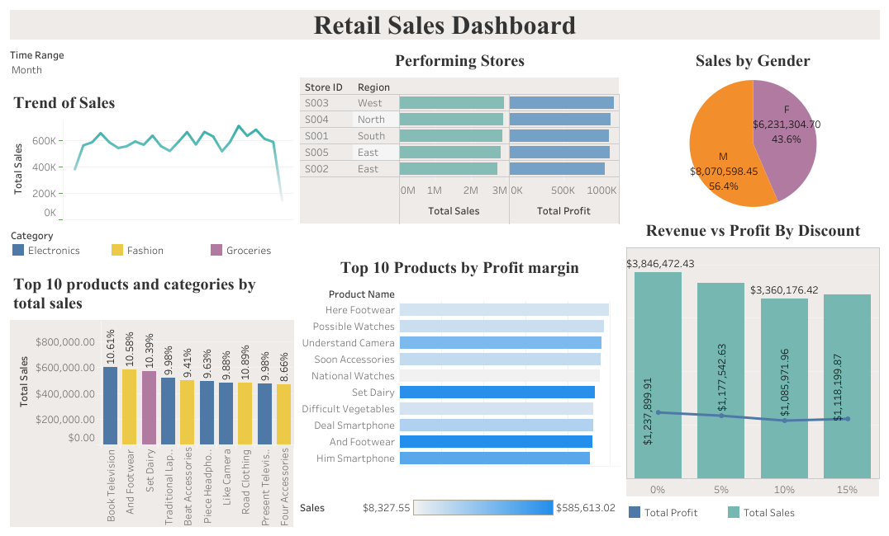

# 🛍️ Retail Sales Analysis (PostgreSQL + Tableau)

## 📁 Overview
This project demonstrates an **end-to-end retail sales analytics pipeline**, starting from raw data ingestion in PostgreSQL, data cleaning and exploration with SQL, and final visualization with Tableau.  

The dataset simulates a retail business environment with **5,000+ transactions**, multiple stores, customers, and product categories.  

---

## 🎯 Objectives
- Import, clean, and structure raw retail sales data into PostgreSQL.  
- Perform **SQL-based EDA** and answer key business questions:
  - Top products and categories by sales & profit  
  - Sales trends (monthly, quarterly, yearly)  
  - Best-performing stores & regions  
  - Customer behavior by demographics (age, gender, city)  
  - Average Order Value (AOV) & Customer Lifetime Value (CLV)  
  - Impact of discounts on revenue and profit  
  - Profit margins by product  
- Build a **Tableau dashboard** to communicate insights visually.  

---

## ⚙️ Tools & Skills
- **PostgreSQL** – Data storage, EDA, business analysis queries  
- **Tableau Desktop** – Interactive dashboards  
- **SQL** – Joins, CTEs, Window Functions, Subqueries, Aggregations  
- **Data Storytelling** – Presenting analysis and actionable business insights  

---

## 📊 Dataset
Source: [Kaggle – Retail Sales Dataset](https://www.kaggle.com/datasets/buharishehu/retail-sales-dataset/data) 
- **Processed Version (this repo):** [View CSV Files](Dataset)

The dataset contains:
- **Customers**: demographics and membership details  
- **Products**: pricing, categories, cost vs unit price  
- **Stores**: store-level and regional information  
- **Transactions**: fact table with 5,000+ purchases  

---

## 📂 Project Files

- 📄 [Full Project Report (PDF)](Retail_Sales_Report.pdf)  
  Contains project objectives, EDA in SQL, business analysis, and conclusions.

- 💻 [SQL Queries](retail_sales_analysis.sql)  
  Includes data cleaning, exploratory queries, and business analysis (CTEs, Window Functions, Aggregations).

- 🔹  
  
- 🌍 [Explore on Tableau Public](https://public.tableau.com/app/profile/trevor4704/viz/DashboardRetailSales/RetailSalesDashboard)
---

## Key Insights
- 📈 **Top Products**: Book Television, And Footwear, Set Dairy drive the highest total sales (~2.2% of units each).  
- 🛒 **Sales Trends**: Strong seasonality – sales peak every December (Q4), drop in January-February.  
- 🏬 **Best Stores**: Store S003 ("New Michele") leads in both revenue and profit.  
- 👥 **Customer Demographics**: Older (55+) male customers generate the highest sales & profit.  
- 💳 **Customer Value**: High-CLV customers differ – some buy frequently with small orders, others occasionally but with very high AOV.  
- 🎯 **Discounts**: Higher discounts reduce both revenue and profit; no discount maximizes income.  
- 💰 **Profit Margins**: Healthy (40–46%) across top products, proving strong pricing strategies.  

---

## How to Use
1. Clone this repo:  
   ```bash
   git clone https://github.com/MayeDiaz818/Retail-Sales-Analysis-SQL-PowerBI.git
2. Import CSV files into PostgreSQL.
3. Run queries from /sql to reproduce analysis.
4. Open Tableau Public to explore interactive dashboards.

---

## 🔹 Closing Reflection

This project was a valuable experience to strengthen my Data Analyst skills. I applied SQL for data cleaning, EDA, and business analysis, and used Tableau for clear visualization. It helped me practice turning business questions into measurable KPIs and actionable insights — an essential skill set for real-world analytics.

## Author
👤 **Mayerlin Díaz**    
🔗 [LinkedIn Profile](https://www.linkedin.com/in/mayerlin-diaz-623986256/)  
